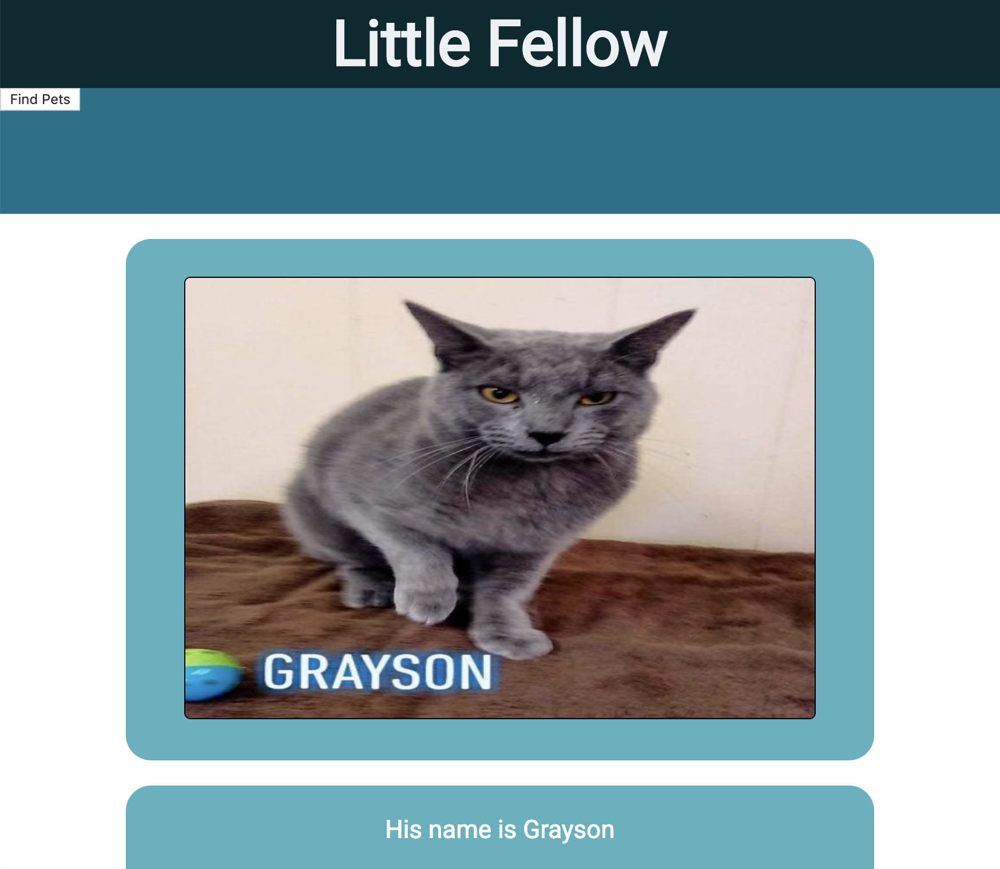
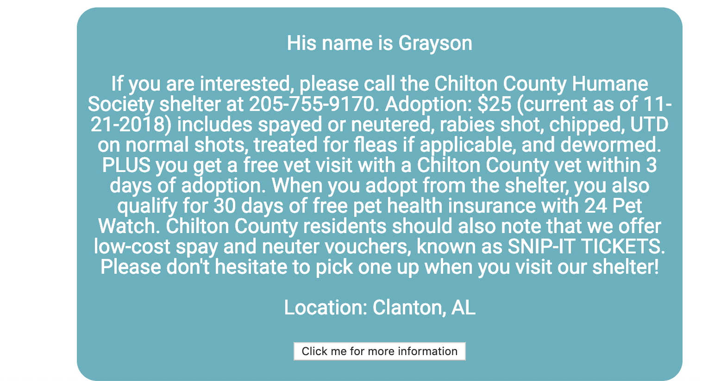
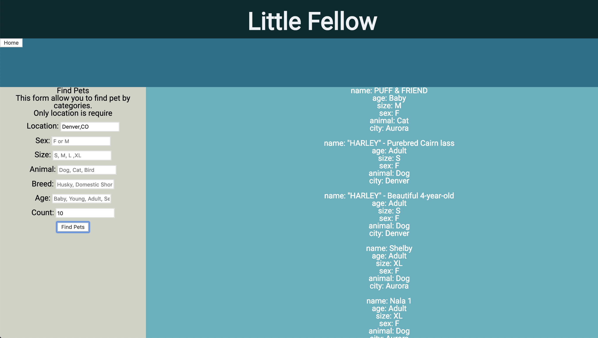

# Little Fellow

## Introduction
This application allow the user find information about pets of different breed in adoption.

## Initial Setup

These instructions will get a copy of the project up and running on your local machine for development and testing purposes.

From GitHub clone down repository using the following commands in terminal:

    git clone git@github.com:Diazblack/little_fellow_fe.git
    cd little_fellow_fe

## How to Use

In the project directory run:

### `npm install`

To install all the dependencies.

### Running the Server Locally

### `npm start`

Runs the app in the development mode, to view it in the browser click the link bellow:
[http://localhost:8080](http://localhost:8080).

Be sure to `npm run build` and commit before each push to master. A few seconds after you push up.

### Home Page

When a user visit the homepage, will see a basic information about a random pet for adoption, if the user want to see more information about the love animal can click on the button at the end of the page, it will display all the information related if is available.

### Find page

The user can click on the left corner of the navegation bar to go on the find page. The user can search by:

* Location: by adding in the field a `City, ST` or zipcode `00000`

* Sex: `F` for Female `M` male

* Size: User should type `S` for small, `M` medium, `L` large, `XL` for extra large sizes.

* Animal: `barnyard`, `bird`, `cat`, `dog`, `horse`, `reptile`, `smallfurry`.

* Age: `Baby`, `Young`, `Adult`, `Senior`.

* Count: how many records the search will return, less then 20 records.

## Production and Services

A link to the backend app can be found with the documentation [here](https://github.com/Diazblack/little_fellow_be).

The link of the application on Production can be found [here](https://diazblack.github.io/little_fellow_fe/).

## If you wish to contribute:

Fork and clone and create a branch for a new feature. After the feature is complete you can submit a PR to litte_fellow_fe master.

For any questions please contact DiazBlack in Github. Thanks

Cesar Jolibois.

## Known issues

* The app don't property display error messages when a wrong search input is submitted

* The Home page photo can won't load when the pet info don't have a url

* Ajust the image depending on the dimensions  

## Future Iterations

* Create a show page for pets

* Allow users to create accounts and log in

* Add functionality to add, update, and delete favorite pets

* Add functionality find show shelter information

* Add functionality find find pets by shelter

* improve the User experience

## Built With

* [JavaScript](https://www.javascript.com/)
* [jQuery](https://jquery.com/)
* [Mocha](https://mochajs.org/)
* [Chai](https://chaijs.com/)
